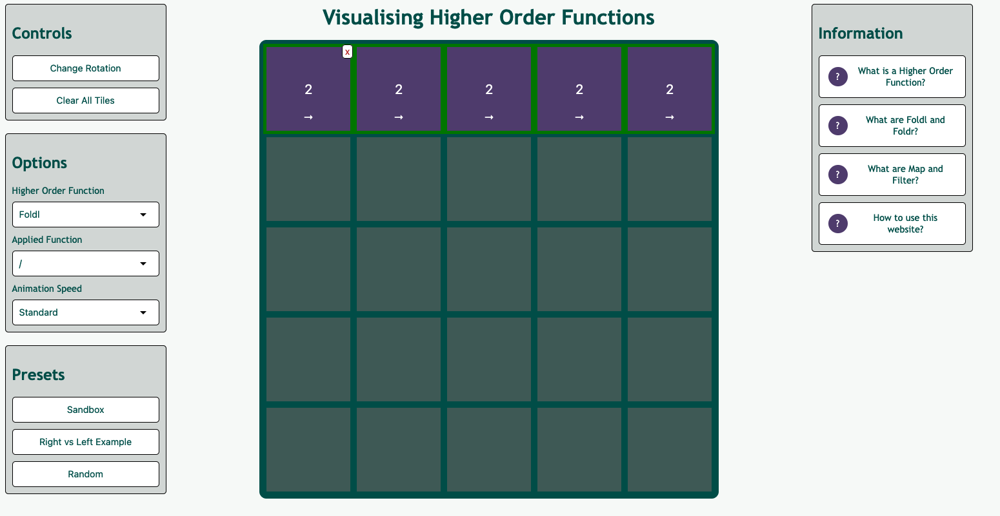

# Visualising Higher Order Functions (VHOF)

An interactive web app for learning how `fold`, `map` and `filter` behave, by watching them run on a grid of numbered tiles.

**Live demo:** https://tobyweir.github.io/VHOF_app/



## What it does

Higher order functions are usually taught as list operations, which makes the order of evaluation hard to see — especially the difference between `foldl` and `foldr` with a non-associative function like `-` or `/`. VHOF turns the list into a row (or column) of tiles and animates each step, so a fold visibly collapses tile by tile in the direction you chose.

Everything runs client side with no build step, no framework and no dependencies.

## Features

- **5×5 grid** of tiles with editable values. Add a tile by hovering a cell and clicking *Add tile*, remove one with the *x* on the tile, or clear the board.
- **Three higher order functions**, selectable from the Options panel:
  - **Fold** — `+`, `-`, `*`, `/`
  - **Map** — `x + 1`, `x - 1`, `x * 2`, `x * 3`
  - **Filter** — `x is odd`, `x is even`, `x > 100`, `x < 100`
- **Rotation** cycles through up → right → down → left. For a fold this sets both the axis and the direction of travel, and the label switches between **Foldl** (right, down) and **Foldr** (up, left). Map and filter have no direction, so rotation just toggles between operating on a row or a column.
- **Step-by-step animation** — merges, spins and shakes are timed rather than instant, at Fast / Standard / Slow speed.
- **Presets** — *Sandbox* (empty grid), *Right vs Left Example* (two identical rows, so you can run a foldl on one and a foldr on the other and compare), and *Random*.
- **Built-in explanations** of higher order functions, foldl vs foldr, map and filter, and how to drive the app.

## How to use it

1. Add tiles with the *Add tile* button, or pick a preset.
2. Click a tile's number to edit it (values default to `0`).
3. Choose a higher order function and the function it should apply.
4. Use *Change Rotation* to pick the direction (or the row/column axis for map and filter). Hovering a tile highlights the tiles that will be affected, and shows arrows for the fold direction.
5. **Double click** any tile in that row or column to run the operation.

## Running locally

The site is static, so cloning and opening `index.html` in a browser works. Serving it avoids any file-protocol quirks:

```bash
git clone https://github.com/tobyweir/VHOF_app.git
cd VHOF_app
python3 -m http.server 8000
# then visit http://localhost:8000
```

## Project structure

| File | Purpose |
| --- | --- |
| `index.html` | Page layout: control panel, grid cells, information boxes |
| `css/` | Styling, plus the keyframe animations for appear, spin, shake, disappear and merge |
| `js/util.js` | Shared helpers, the rotation state, and the lookup tables mapping dropdown values to functions and animation speeds |
| `js/tile.js` | The `Tile` class — builds the DOM element, wires up its events, and owns the animations |
| `js/logic.js` | The grid model and the implementations of fold, map and filter |
| `js/grid.js` | Wires the DOM controls to the logic: selectors, buttons, hover behaviour, info boxes |


Scripts are plain (non-module) and run in order, so `util.js` must load before the others and `grid.js` last — it queries and binds the controls as soon as it runs.

## Implementation notes

**Grid model.** State lives in a 5×5 array of `Tile` objects (`undefined` for empty cells), with each tile mirroring its position onto `xpos`/`ypos` attributes on its DOM element. The tile container is positioned from those attributes, so moving a tile is a matter of updating the model and letting CSS animate the transition.

**Fold.** A fold pulls the non-empty cells out of the row or column, then repeatedly merges the leading pair — from the left for `foldl`, from the right for `foldr`, with the argument order reversed so that `foldr` nests correctly. Each merge is awaited against the current animation delay, and the surviving tile is then moved to the end of the line as the accumulator.

**Concurrency.** Because folds are asynchronous, a `foldCount` flag locks out rotation, tile creation, tile removal and new operations while one is in flight, rather than letting a second fold mutate the grid mid-merge.

**Input handling.** Tile values are free-text inputs constrained to an optional sign, digits and one decimal point, capped at six characters. Values are parsed on read, and anything unparseable falls back to `0`.

